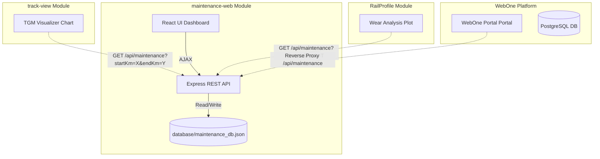

# Specifiche Tecniche - Modulo `maintenance-web`

Il presente documento definisce le specifiche funzionali, la struttura dati e le interfacce di integrazione per il modulo **`maintenance-web`** di RailPulse. Il modulo ha l'obiettivo di gestire in modo persistente l'archivio degli interventi di manutenzione ferroviaria e consentire l'interoperabilità futura con i moduli `track-view`, `RP` (RailProfile) e la piattaforma centrale `WebOne`.

---


## 1. Requisiti Funzionali

Il modulo deve implementare le seguenti funzionalità principali descritte nella sezione *E. Archivio Interventi di Manutenzione (Maintenance Records Database)* delle specifiche generali:

### E1 – Registrazione Interventi (Scrittura)
* Consentire l'inserimento, la modifica e la cancellazione di record di manutenzione.
* Supportare la validazione dei dati in ingresso (es. consistenza delle coordinate chilometriche: `startKm <= endKm`).

### E2 – Ricerca e Filtrazione (Lettura)
* Ricerca degli interventi per intervallo temporale (`dateStart` e `dateEnd`).
* Filtro per tipo di intervento (`taskType`), linea (`line`), binario (`track`) e intervallo chilometrico (`startKm` - `endKm`).
* Supporto per query di intersezione spaziale (trovare tutti gli interventi che si sovrappongono a un determinato tratto chilometrico).

### E3 – Interfaccia e Predisposizione Grafica
* Predisporre i dati in formato strutturato per consentire a moduli grafici (come `track-view`) di visualizzare gli interventi come icone/simboli sovrapposti ai grafici dei parametri geometrici della rotaia.
* Associare a ciascun tipo di intervento una simbologia standard o un codice colore.

---

## 2. Struttura del Database JSON

Il database risiede in un file denominato `maintenance_db.json` all'interno della directory `maintenance-web/database/`. Lo schema dei dati è definito come segue:

### Schema di un Record di Manutenzione (`MaintenanceRecord`)

```json
{
  "$schema": "http://json-schema.org/draft-07/schema#",
  "title": "MaintenanceRecord",
  "type": "object",
  "properties": {
    "id": {
      "type": "string",
      "description": "Identificativo unico auto-generato (es. UUID o timestamp + random tag)"
    },
    "date": {
      "type": "string",
      "format": "date",
      "description": "Data dell'intervento in formato YYYY-MM-DD"
    },
    "taskType": {
      "type": "string",
      "enum": ["Rincalzatura", "Rettifica Rotaia", "Molatura", "Cambio Rotaia", "Saldatura", "Regolazione Tensione", "Altro"],
      "description": "Tipologia dell'operazione di manutenzione svolta"
    },
    "line": {
      "type": "string",
      "description": "Nome o codice della linea ferroviaria (es. Linea A)"
    },
    "track": {
      "type": "string",
      "description": "Identificativo del binario (es. Binario 1, Binario 2, Pari, Dispari)"
    },
    "startKm": {
      "type": "number",
      "minimum": 0,
      "description": "Chilometraggio di inizio intervento in chilometri (es. 100.450)"
    },
    "endKm": {
      "type": "number",
      "minimum": 0,
      "description": "Chilometraggio di fine intervento in chilometri (es. 100.800)"
    },
    "operator": {
      "type": "string",
      "description": "Operatore o ditta appaltatrice che ha eseguito il lavoro"
    },
    "status": {
      "type": "string",
      "enum": ["Pianificato", "In Corso", "Completato", "Annullato"],
      "description": "Stato di avanzamento dell'intervento"
    },
    "notes": {
      "type": "string",
      "description": "Note aggiuntive, dettagli tecnici o anomalie riscontrate"
    },
    "attachments": {
      "type": "array",
      "items": {
        "type": "string"
      },
      "description": "Percorsi o URL di foto, verbali o file allegati (opzionale)"
    },
    "externalRef": {
      "type": "object",
      "properties": {
        "erpId": { "type": "string", "description": "ID dell'ordine di lavoro su ERP esterno (es. SAP)" },
        "tgmId": { "type": "string", "description": "ID dell'acquisizione TGM correlata" },
        "rpId": { "type": "string", "description": "ID del file RailProfile associato" }
      },
      "additionalProperties": false,
      "description": "Riferimenti esterni per l'integrazione tra moduli"
    },
    "createdAt": {
      "type": "string",
      "format": "date-time"
    },
    "updatedAt": {
      "type": "string",
      "format": "date-time"
    }
  },
  "required": ["id", "date", "taskType", "line", "track", "startKm", "endKm", "status"]
}
```

---

## 3. Definizione delle API REST (Predisposizione Integrazione)

Il server backend esporrà le seguenti rotte per consentire l'interazione programmata con gli altri sistemi:

### `GET /api/maintenance`
Recupera l'elenco degli interventi, supportando filtri tramite query parameter:
* `line`: filtra per linea.
* `track`: filtra per binario.
* `taskType`: filtra per tipo di lavoro.
* `dateStart` / `dateEnd`: intervallo temporale (YYYY-MM-DD).
* `startKm` / `endKm`: intervallo chilometrico. Restituisce tutti gli interventi la cui tratta si sovrappone a quella richiesta.
  * *Logica di sovrapposizione*: `record.startKm <= query.endKm AND record.endKm >= query.startKm`.

### `GET /api/maintenance/:id`
Recupera i dettagli di un singolo intervento tramite il suo ID.

### `POST /api/maintenance`
Crea un nuovo intervento. Esegue la validazione dei campi obbligatori e l'ordinamento chilometrico prima di salvare su JSON.

### `PUT /api/maintenance/:id`
Aggiorna i campi di un intervento esistente.

### `DELETE /api/maintenance/:id`
Elimina definitivamente un intervento dall'archivio JSON.

---

## 4. Strategia di Integrazione Futura



### A. Integrazione con `track-view` (Visualizzatore TGM)
* **Visualizzazione Grafica**: Quando l'operatore visualizza i grafici geometrici di una tratta in `track-view`, l'applicazione invia una richiesta HTTP `GET /api/maintenance` filtrando per la linea, il binario e il range di Km correnti.
* **Simboli Sovrapposti**: Gli interventi restituiti vengono visualizzati sull'asse X del grafico in corrispondenza del chilometraggio dell'intervento. Passando il mouse sopra il simbolo (es. icona di un martello 🛠️ o di una chiave inglese), un tooltip mostrerà i dettagli dell'intervento (Data, Tipo, Operatore).

### B. Integrazione con `RP` (RailProfile)
* Nel grafico del profilo di usura della rotaia, cliccando su un punto chilometrico specifico o rilevando un'usura eccessiva, l'operatore può visualizzare la lista degli interventi passati in quella esatta coordinata per verificare se sia già stato effettuato un cambio rotaia o una molatura.
* Collegamento tramite `externalRef.rpId` per associare le curve di usura all'intervento di manutenzione correttivo effettuato.

### C. Integrazione con `WebOne` (Portale Centrale)
* **Reverse Proxy**: Il server Express di `WebOne` integrerà le rotte di `maintenance-web` tramite un proxy, esponendole come `/api/maintenance`.
* **Database Link / ERP**: Eventuali sincronizzazioni con l'ERP del cliente (es. SAP) utilizzeranno il campo `externalRef.erpId` per allineare gli ordini di lavoro chiusi sul gestionale con gli interventi effettivi registrati sul binario.


### 5. Definizione della Palette di Colori (Color Palette)

Per garantire uniformità visiva tra i moduli **`maintenance-web`**, **`track-view`** e **`RailProfile`**, si definisce di seguito la palette di colori ufficiale da utilizzare in tutti i badge, icone e componenti grafici. I colori sono espressi in notazione esadecimale e nelle classi Tailwind corrispondenti. Il layout è descritto in Specifiche/gen_layout.md
