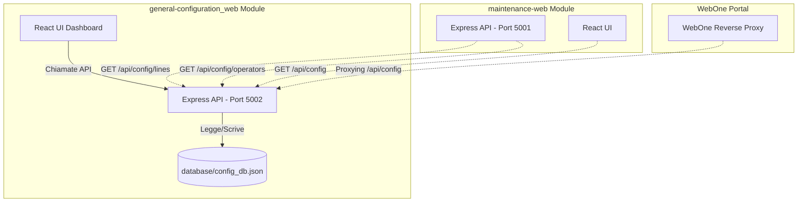

# Specifiche Tecniche - Modulo `general-configuration_web`

Il presente documento definisce le specifiche funzionali, la struttura dati e le interfacce di integrazione per il modulo **`general-configuration_web`** di RailPulse. L'obiettivo principale di questo modulo è centralizzare e gestire tutte le configurazioni comuni dell'intera piattaforma RailPulse, come le impostazioni di lingua e i database condivisi (linee ferroviarie, operatori, ditte e tipologie di intervento con relative codifiche grafiche).

In futuro, questo modulo sarà interfacciato e integrato all'interno della piattaforma centrale `WebOne`.

> **Nota sul Layout**: L'interfaccia utente e il layout di questo modulo devono seguire rigorosamente le regole e direttive descritte nel documento condiviso [`gen_layout.md`](../../Specifiche/gen_layout.md).

---

## 1. Requisiti Funzionali

Il modulo gestisce le seguenti aree di configurazione:

### GCA – Lingua di Sistema (Internazionalizzazione)
* Gestire la lingua predefinita della piattaforma (es. Italiano `it`, Inglese `en`, Cinese `zh`).
* Fornire l'elenco delle lingue supportate e delle relative etichette descrittive.

### GCB – Database Linee e Binari (Railway Lines GIS Database)
* Gestire l'elenco delle linee ferroviarie abilitate nel sistema.
* Per ciascuna linea, associare l'intervallo chilometrico di competenza (es. `startKm` e `endKm`) e i singoli binari attivi (es. "Binario 1", "Binario 2", "Pari", "Dispari").
* Consentire l'aggiunta, la modifica e l'eliminazione di linee e dei relativi binari.

### GCC – Database Operatori e Appaltatori (Operators Database)
* Gestire l'anagrafica comune delle ditte appaltatrici e degli operatori che eseguono gli interventi di manutenzione sulla rete.
* Fornire a moduli esterni (come `maintenance-web`) una lista aggiornata e consistente per popolare i menu a tendina.

### GCD – Tipologie di Intervento e Codifiche Grafiche (Task Types & Symbols)
* Gestire l'elenco delle tipologie di manutenzione (es. Rincalzatura, Molatura, Cambio Rotaia).
* Associare a ciascuna tipologia un codice colore esadecimale (HEX) e un'icona/simbolo standard (Emoji o SVG).
* Questa associazione garantisce che in tutti i grafici della piattaforma (es. `track-view`, `RailProfile`) lo stesso intervento sia rappresentato in modo uniforme.

---

## 2. Struttura del Database JSON (`config_db.json`)

Tutte le configurazioni persistono in un file JSON denominato `config_db.json` situato nella directory `general-configuration_web/database/`.

Lo schema JSON è strutturato come segue:

```json
{
  "$schema": "http://json-schema.org/draft-07/schema#",
  "title": "GeneralConfiguration",
  "type": "object",
  "properties": {
    "language": {
      "type": "object",
      "properties": {
        "active": { "type": "string", "enum": ["it", "en", "zh"] },
        "available": {
          "type": "array",
          "items": {
            "type": "object",
            "properties": {
              "code": { "type": "string" },
              "label": { "type": "string" }
            },
            "required": ["code", "label"]
          }
        }
      },
      "required": ["active", "available"]
    },
    "lines": {
      "type": "array",
      "items": {
        "type": "object",
        "properties": {
          "id": { "type": "string", "description": "ID unico della linea (es. line_a)" },
          "name": { "type": "string", "description": "Nome della linea (es. Linea A)" },
          "startKm": { "type": "number", "minimum": 0 },
          "endKm": { "type": "number", "minimum": 0 },
          "tracks": {
            "type": "array",
            "items": { "type": "string" },
            "description": "Lista dei binari associati (es. ['Binario 1', 'Binario 2'])"
          }
        },
        "required": ["id", "name", "startKm", "endKm", "tracks"]
      }
    },
    "operators": {
      "type": "array",
      "items": { "type": "string" },
      "description": "Lista delle ditte e degli operatori autorizzati"
    },
    "taskTypes": {
      "type": "array",
      "items": {
        "type": "object",
        "properties": {
          "name": { "type": "string", "description": "Nome della tipologia (es. Rincalzatura)" },
          "color": { "type": "string", "pattern": "^#[0-9A-Fa-f]{6}$", "description": "Colore HEX associato" },
          "icon": { "type": "string", "description": "Carattere emoji o simbolo associato (es. 🛠️)" }
        },
        "required": ["name", "color", "icon"]
      }
    }
  },
  "required": ["language", "lines", "operators", "taskTypes"]
}
```

---

## 3. Definizione delle API REST

Il server backend (esposto sulla porta `5002`) fornisce i seguenti endpoint:

### A. Rotte Globali di Configurazione
* **`GET /api/config`**: Restituisce l'intero file delle configurazioni.
* **`POST /api/config/language`**: Imposta la lingua attiva del sistema.
  * *Request Body*: `{ "active": "it" }`

### B. Rotte Gestione Linee e Binari
* **`GET /api/config/lines`**: Restituisce la lista di tutte le linee.
* **`POST /api/config/lines`**: Crea una nuova linea.
  * *Request Body*: `{ "id": "line_c", "name": "Linea C", "startKm": 0, "endKm": 50, "tracks": ["Pari", "Dispari"] }`
* **`PUT /api/config/lines/:id`**: Aggiorna una linea esistente.
* **`DELETE /api/config/lines/:id`**: Elimina una linea.

### C. Rotte Gestione Operatori
* **`GET /api/config/operators`**: Restituisce l'elenco degli operatori.
* **`POST /api/config/operators`**: Aggiunge un operatore.
  * *Request Body*: `{ "name": "Ditta Costruzioni S.p.A." }`
* **`DELETE /api/config/operators/:name`**: Elimina un operatore.

### D. Rotte Gestione Tipologie di Intervento
* **`GET /api/config/task-types`**: Restituisce le tipologie e le relative codifiche.
* **`POST /api/config/task-types`**: Aggiunge o aggiorna una tipologia.
  * *Request Body*: `{ "name": "Saldatura", "color": "#00FF00", "icon": "🔥" }`
* **`DELETE /api/config/task-types/:name`**: Elimina una tipologia.

---

## 4. Strategia di Integrazione Futura con `WebOne` e altri moduli



### A. Integrazione con `maintenance-web` e altri moduli verticali
* **Rimozione Hardcoding**: Le lista a tendina di `maintenance-web` (Linee, Binari, Operatori, Tipi Intervento) non saranno cablate nel codice, ma verranno popolate dinamicamente effettuando una chiamata a `GET http://localhost:5002/api/config/lines` ecc.
* **Coerenza Linguistica**: All'avvio dell'applicazione, ciascun modulo leggerà la lingua attiva da `GET http://localhost:5002/api/config` per allineare l'interfaccia utente.

### B. Integrazione con `WebOne`
* **Reverse Proxy**: Il server `WebOne` utilizzerà `http-proxy-middleware` per reindirizzare `/api/config/*` verso il server `general-configuration_web` in esecuzione sulla porta `5002`.
* **Centralizzazione**: `WebOne` agirà da punto d'accesso unico per l'utente, incorporando la Dashboard di configurazione come un tab o sottomenu all'interno del pannello "Impostazioni di Sistema".
